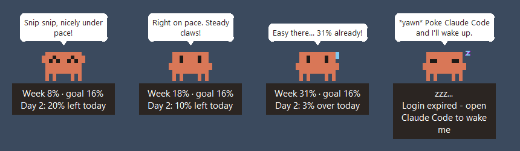

# Clawd Pacer

A tiny pixel Clawd that lives on your Windows desktop and helps you pace your **weekly Claude usage limit**.



- Target: **14% per day** (98% by the end of your week), growing smoothly by the hour.
- Reads your weekly usage % automatically, and knows your personal reset time.
- Mood shows your pace: happy (under), okay (on pace), worried (over), sleepy (no data).
- Personality: blinks, waves, hops when poked, cheerful speech bubbles, little synth beeps and chirps.
- Quiet hours (22:00-08:00), mute toggle, drag anywhere, right-click for the menu.

## Who it works for
| You need | Why |
|---|---|
| **Windows 10/11** | Uses Windows-only see-through windows and sounds. Mac/Linux: not yet. |
| **Python 3.10+** from [python.org](https://www.python.org/downloads/) | Keep "tcl/tk and IDLE" ticked (it is by default). |
| **Claude Code**, logged in with a **Pro or Max** plan | Clawd reads your usage using Claude Code's login. API-key logins and claude.ai-only users have no weekly limit to show. |

## Install (2 minutes)
1. Download: green **Code** button > **Download ZIP**, unzip it somewhere permanent
   (e.g. `Documents\clawd-pacer`), or `git clone https://github.com/pjecuacion/clawd-pacer`.
2. Double-click **`scripts\install.bat`**.

That's it. Clawd appears bottom-right and will start with Windows from now on.
If you move the folder later, just run `install.bat` again.

## Use
- **Drag** to move. **Click** to poke. **Right-click**: Refresh now / Mute sounds / Quit.
- Panel shows `Week 20% · goal 16%` and how much room is left before today's checkpoint.
- Change the daily target, quiet hours, chatter rate, etc. in `clawd_pacer/config.py`.

## Clawd is sleepy?
| Bubble says | Do this |
|---|---|
| Login expired - open Claude Code to wake me | Use Claude Code for a moment; it renews its login. Clawd wakes on the next check (or right-click > Refresh). |
| Log into Claude Code with your Pro/Max account | Run `claude` and log in with your subscription. |
| No weekly limit found - needs a Pro/Max plan | Your account has no weekly limit to pace. |
| Can't reach Claude right now | Internet is down or Claude is having issues. It retries every 5 minutes. |

## Uninstall
Right-click Clawd > Quit, run `scripts\install.bat --uninstall`, then delete the folder.

## Heads-up
- Usage comes from an **unofficial** Claude endpoint (`/api/oauth/usage`). It may change without notice;
  if it does, Clawd just naps instead of crashing.
- Your login token is read locally and only ever sent to Anthropic's API. Clawd never renews it itself
  (that could log you out of Claude Code).
- Not affiliated with Anthropic. "Clawd" is Claude Code's mascot; this is a fan project.

## Development
```
python -m venv .venv && .venv\Scripts\pip install pytest
.venv\Scripts\python -m pytest
.venv\Scripts\python -m clawd_pacer --check   # one-line status in the console
```
